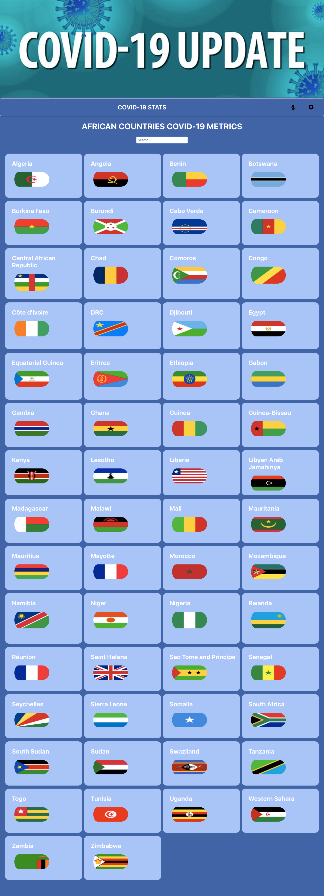
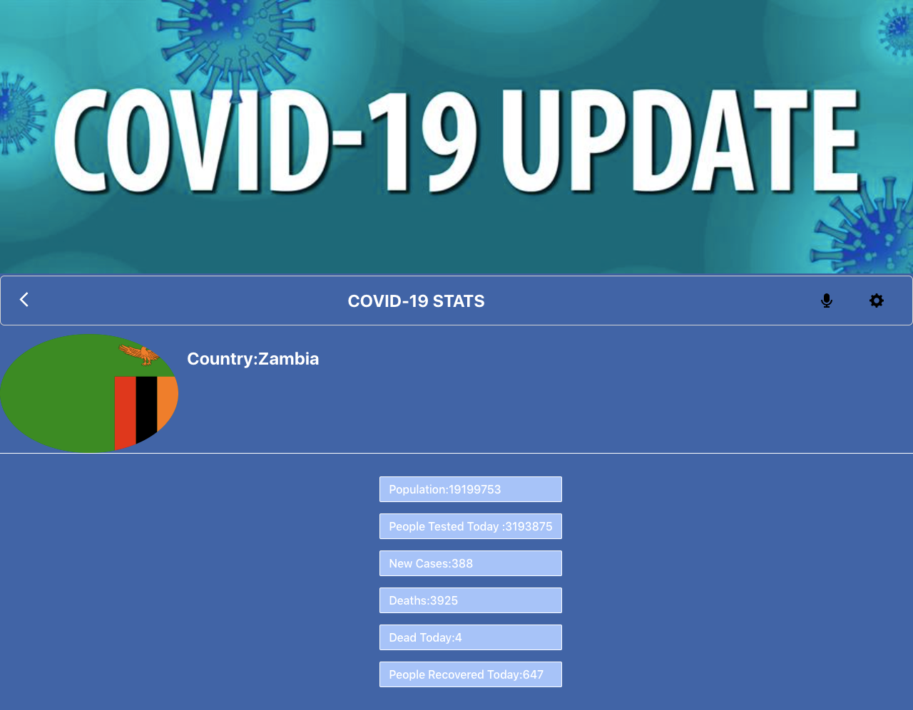

# COVID-19-Metrics

> "COVID-19-Metrics" is a Single page Application(S.P.A) built using React and redux in this project information on the COVID-19 virus is being fetched from an API. This Application shows data on COVID-19 specifically in African countries, the information is on COVID-19 cases, deaths, people tested and people that have recovered from the deadly virus.

## Screenshots:





## Built With

- HTML
- CSS
- JavaScript
- REACT
- Redux
- Webpack
- Jest

## Online live link

[Live Demo](https://festive-lichterman-da1784.netlify.app/)
[Video Link](https://www.loom.com/share/35d49b393df645b1bcf9642a21d74dc9)

## Getting Started

To get a local copy up and running follow these simple example steps.

### Prerequisites
- A text editor(preferably Visual Studio Code)
- Node
- Web browser

### Install
- [Git](https://git-scm.com/downloads)
- [Node](https://nodejs.org/en/download/)

### Using it Locally

- Clone the project (https://github.com/KayLemba/covid19-metrics.git)

```bash 
git clone 

cd space-travelers-hub
```

- Install dependencies

```bash
npm i 
or
npm install
```
- To Start the development server
```bash
npm start
```

- To test the project
```bash
npm run test
```


## Visit And Open Files

[Visit Repo](https://github.com/KayLemba/covid19-metrics)

## Download Repo

[Download Repo](https://github.com/KayLemba/covid19-metrics.git)

## Authors

👤 **Kalolo Chola Lemba**

- GitHub: [@KayLemba](https://github.com/KayLemba)
- Twitter: [@King-Kaylo1](https://twitter.com/King_Kaylo1) 
- LinkedIn: [@kalolo-lemba](https://www.linkedin.com/in/https://www.linkedin.com/in/kalolo-lemba-41a8339a/-41a8339a/)


## 🤝 Contributing

Contributions, issues, and feature requests are welcome!

Feel free to check the [issues page](https://github.com/thecodechaser/space-travelers-hub/issues).

## Show your support

Give a ⭐️ if you like this project!

## Acknowledgments

- Thumbs up to 'Nelson Sakwa' for the design inspiration.

## Data is provided by the following institutions:
Johns Hopkins University

## 📝 License

This project is [MIT](./MIT.md) licensed.
